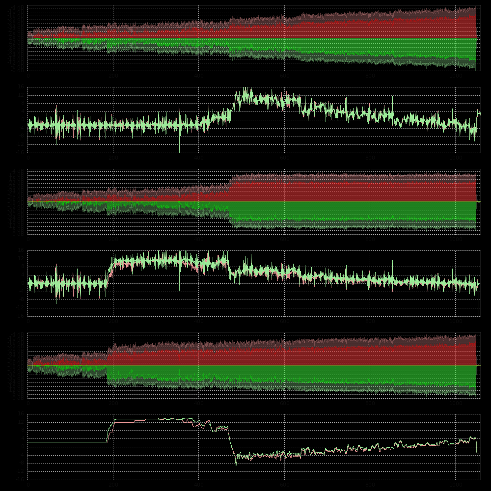

# compareRms.pl
plot peak RMS values of 2 audio files and difference between.
I used this to compare results of my audio mastering plugins with others.
``` 
DESCRIPTION:
compareRms will plot audio peak and RMS values
Usage: rms [OPTION...] audioFile
OPTIONS:
    -i --input  audio       path of any audio or video file to be plotted
    -o --output image       path of target PNG file, if ommited use audioFile.png
    -r --resolution VALUE   RMS resolution for each line of output in seconds, default is 1.5
    -l --limit              cut off RMS values lower than limit in dB, default is -36
    -t --template FILE      use given gnuplot template file instead of build-in template
    -v --verbose            verbose output
    -h --help               this help
    --no-delete             do not delete files
Example - compare bolero.1 and bolero.2:
$ compareRms.pl -i bolero 
```


